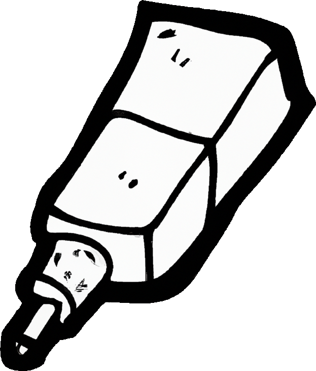

<h6 align="center">
  
</h6>

# adhesive

A simple (not freestanding) library that implements some basic data structures, such as:
- linked list (void* only)
- vector (dynamic arrays)
- string (heap allocated string)

